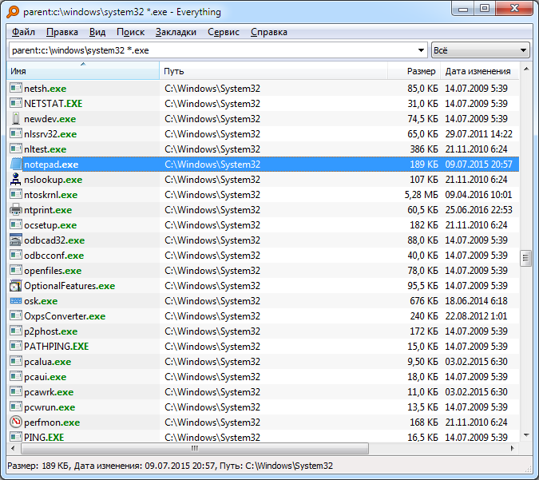

# 🔎 Everything — молниеносный поиск файлов на Windows


**Everything** — это лёгкая, быстрая и бесплатная утилита, которая позволяет находить файлы и папки на вашем компьютере за доли секунды.  

> ⚡ Замените медленный поиск Windows на инструмент, который работает *моментально*.

---

## 📥 Скачать Everything

👉 [Скачать Everything (официальная версия)](https://ваша-ссылка.ru)  
🔗 Альтернативная ссылка или партнёрская: [Загрузить через наш сайт](https://ваша-ссылка.ru)

---

## 🧰 Основные возможности

- Поиск файлов и папок по имени мгновенно
- Очень лёгкий: вес < 2 МБ
- Не нагружает систему
- Удобный интерфейс
- Поддержка регулярных выражений
- Работа в фоновом режиме

---

## 📸 Интерфейс программы



---

## 🚀 Как использовать

1. Скачайте и установите Everything
2. Откройте программу — она проиндексирует ваш диск за считанные секунды
3. Введите часть имени файла — и получите результат сразу

---

## 🧩 Похожие полезные инструменты

```Раздел наполняется```

---

## 📎 Лицензия

Программа распространяется официально как бесплатная. Автор — [Voidtools](https://www.voidtools.com).
